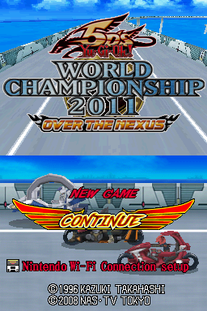

# snake_arm9
A simple snake game coded in ARM assembly language for the Nintendo DS.

## How it works

Yu-Gi-Oh! 5D's World Championship 2011 - Over the Nexus has a buffer overflow vulnerability in the player's name. By having a very long player name that goes beyond the character limit set by the game, its possible to overwrite the "return address" to point it to somewhere else in memory to allow for arbitrary code execution (an ability to run whatever custom code you want).

The payload (snake game) is stored in the provided savefile here where the cards unlocked is located. Both player name and cards unlock values is loaded into memory at the titlescreen - where you see New Game and Continue. After selecting Continue, the game then reads the long player name that contains the new address and changes the "return address" in the process to point it to the payload that is stored in the cards unlocked location, and starts executing it.

See [arm9.s](arm9.s) file for the payload instructions (snake game source code).

## How to setup
1. Download the savefile located in the [save](save/) directory.

> [!NOTE]
> Make sure you download the correct savefile for your game's region (Europe, USA, Japan). Also, you'll notices that at the end of each filename, theres *melon_PC* or *melon_android*. *melon_PC* is for the desktop version of melonDS emulator (Windows, Mac, Linux) and *melon_android* is for the android port of melonDS emulator.

> [!WARNING]
> If you have an existing savefile, be sure to backup that first by either renaming it or make a copy of it. This is so that you can go back to your original savefile after you're done messing around with the modified savefile provided here.

2. Place your savefile that you've downloaded in the same directory as your Nintendo DS ROMs (this is most likley the case, depending on the setup/emulator).

3. Rename your downloaded savefile with the same filename as your Nintendo DS ROM.

4. Run melonDS emulator and select the game with the modified savefile.

5. At the "titlescreen" where you see New Game and Continue, select Continue.

If it works, you should see this screen:

Congratulations. You can now play the snake game.

## Controls
D-Pad - Move Snake / Change Snake direction

START - Start Game / Pause / Un-Pause / Play Again

## Compiling the source code (arm9.s)
> [!NOTE]
> If you already have devkitPro installed, then go to Step 2.
1. You'll need to install devkitPro: [https://devkitpro.org/wiki/Getting_Started](https://devkitpro.org/wiki/Getting_Started)

When you have devkitPro installed and your able to compile one of the NDS examples, go to Step 2.

2. Download and extract the source code hosted on this Github page.

3. Navigate inside the source code folder that you've downloaded. You should see:
* arm9.s
* font.s
* Makefile
* string.s

Copy the path to the source code folder.
e.g. `C:\path\to\snake_arm9-main`

4. Open Terminal (cmd.exe if your on Windows)
   
5. Type and execute `cd` followed by the path to the source code folder. e.g. `cd C:\path\to\snake_arm9-main`

6. Type and execute `make`

7. If successful, a new file 'payload.bin' should be created inside the source code folder.

## Tested and working
* melonDS emulator v0.9.5 win_x64 (Windows)

* melonDS-android

* desmume emulator v0.9.13-win64 (Windows)

## Credits
1. This whole project was based on this information.
[https://cturt.github.io/DS-exploit-finding.html](https://cturt.github.io/DS-exploit-finding.html)

2. ARM programming for the Nintendo DS.
[https://www.chibialiens.com/arm/nds.php](https://www.chibialiens.com/arm/nds.php)

3. CheatSheet for all the ARM commands.
[https://www.chibialiens.com/arm/CheatSheet.pdf](https://www.chibialiens.com/arm/CheatSheet.pdf)

4. 8x8 Font used for this project.
[https://www.coranac.com/tonc/img/tonc_font.png](https://www.coranac.com/tonc/img/tonc_font.png)

5. devkitPro to compile code for the Nintendo DS.
[https://devkitpro.org/](https://devkitpro.org/)
