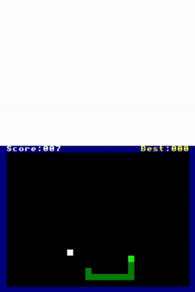

# snake_arm9
Snake game coded in ARM9 assembly language.

## How to setup
Download the savefile located in the /save directory.
> [!NOTE]
> Make sure that you download the correct savefile for your game's region. Also, you'll notices that at the end of the filename, there are *melon_PC* and *melon_android*. *melon_PC* is for the desktop version of melonDS emulator (Windows, Mac, Linux, etc.) and *melon_android* is for the android port of melonDS emualtor.

> [!WARNING]
> If you have an existing savefile, be sure to backup that first by either renaming it or make a copy of it. This is so that you can go back to your original savefile after you're done messing around with the modified savefile.
Place your savefile in the same directory as your Nintendo DS ROMs (most likley, depending on the setup/emulator). Next, rename your downloaded savefile the same as your Nintendo DS ROM filename.

Run melonDS emulator and select the game with the modified savefile.
At the "titlescreen" where you see New game and Continue, select Continue.
If it works, you should see this screen:

## Controls
D-Pad - Play / Change Snake direction

START - Start Game / Pause / Un-Pause / Play Again

## Tested and working
melonDS emulator v0.9.5 win_x64 (Windows)

melonDS-android

desmume emulator v0.9.13-win64 (Windows)

## Credits
1. This whole project was based on this information.
[Exploting DS save games](https://cturt.github.io/DS-exploit-finding.html)

2. Programming for the Nintendo DS in ARM assembly language.
[ARM programming for the Nintendo DS](https://www.chibialiens.com/arm/nds.php)

3. CheatSheet for all the ARM commands.
[ARM9 CheatSheet](https://www.chibialiens.com/arm/CheatSheet.pdf)

4. 8x8 Font used.
[Tonc Text Systems](https://www.coranac.com/tonc/img/tonc_font.png)
